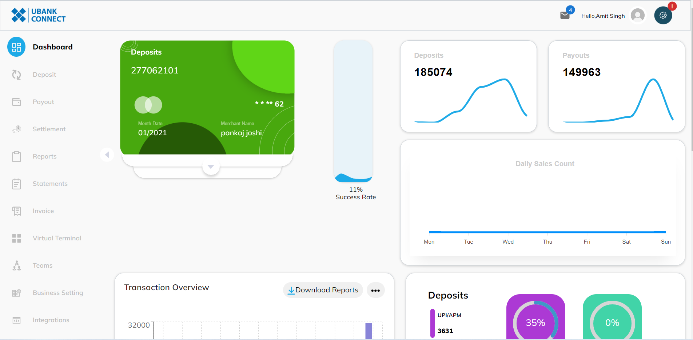
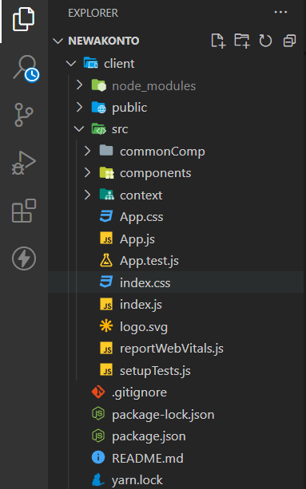

## Available Scripts

In the project directory, you can run:

### `yarn install`

For install the dependencies.

### `yarn start`

Runs the app in the development mode.\
Open [http://localhost:3000](http://localhost:3000) to view it in your browser.

The page will reload when you make changes.\
You may also see any lint errors in the console.  
###  Here is Output  of `yarn start`

  
### `yarn test`

Launches the test runner in the interactive watch mode.\
See the section about [running tests](https://facebook.github.io/create-react-app/docs/running-tests) for more information.

### `yarn build`

Builds the app for production to the `build` folder.\
It correctly bundles React in production mode and optimizes the build for the best performance.

The build is minified and the filenames include the hashes.\
Your app is ready to be deployed!

See the section about [deployment](https://facebook.github.io/create-react-app/docs/deployment) for more information.

## Folder Structure  
<!-- Img -->

### `CommonComp`
Here All the common files Like  `Card` `Table` is here
### `Components`
Here All the Components files are here
  - Dashboard
     - Api
        - card
        - graph
        - Deposits By Currency
        - Top Transactions
        - Deposits
  - Deposite
      - Api
        - Deposite
  - Payout
      - Api
        - Payout
  - Settelment
     - Api
        - Settelment
  - Reports
     - Api
        - Reporsts
  - Statements
     - Api
        - Statements
  - Invoice
     - Api
        - Create Invoice
        - Invoice
  - Teams
     - Api
        - Create Teams
        - Teams
  - Business Settings
     - Api
        - Company Profile
        - Solutions Applying For
        - Director’s Info
        - Shareholder Info
        - Company Profile
        - Company Profile
        

  - Integrations
       - No Api Call
  - Change Password
     - Api
        - Change Password
  - Logout

### `Router`
All  route is Define in Router folder